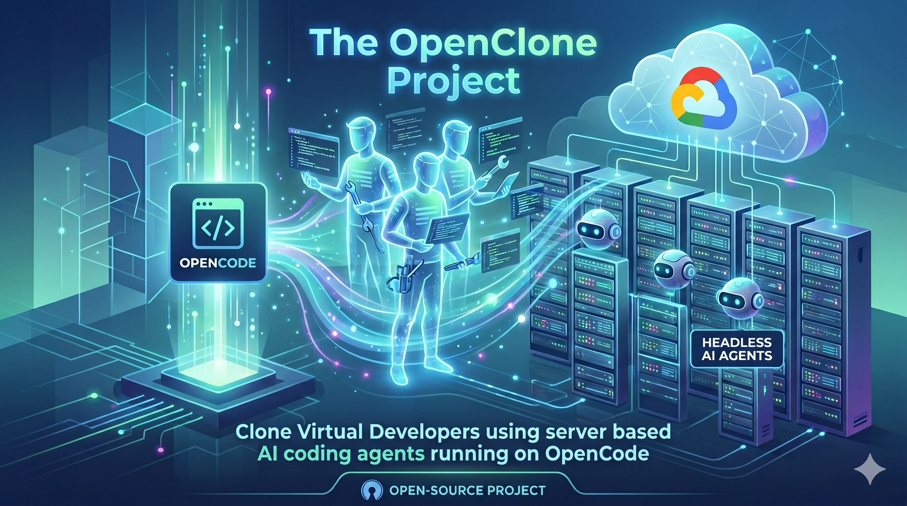

<!-- VIDEO OVERVIEW PLACEHOLDER -->
<!-- [▶ Watch the YouTube overview](https://youtube.com/TODO) -->

## What Is This?

OpenClone is a prototype demonstrating **headless, server-based AI coding agents** that can execute self-directed coding tasks autonomously — no human sitting at a keyboard required.

The concept is inspired by [Ramp's blog post on automating work processes with background agents](https://builders.ramp.com/post/why-we-built-our-background-agent). The idea: instead of having a developer context-switch to handle a one-off task (a bug fix, a small feature, a refactor), you spin up an agent, hand it the task, and let it work — just like cloning the developer for that task.

This prototype runs on **GCP (Google Cloud Platform)**, but the architecture is cloud-agnostic and could be adapted to AWS, Azure, or any VM-based environment.

> **Disclaimer:** This is a demonstration tutorial, not a production-hardened implementation. It is intended to illustrate the concept and get something working end-to-end. Security, scalability, and operational concerns are out of scope.

## Built On OpenCode

OpenClone makes heavy use of [OpenCode](https://opencode.ai/), an open-source, terminal-native AI coding assistant. OpenCode provides the agent runtime — OpenClone wraps it in a server-side, headless workflow so tasks run without any local IDE or developer present.

## Project Structure

```
OpenClone/
├── OpenClone.md          # Step-by-step demo walkthrough
├── reasoning-tester/     # Tool for testing and validating agent reasoning
│   ├── app.py
│   └── requirements.txt
└── test/
    └── calculator.html   # Simple HTML target used for coding change demos
```

## Site Map

| Resource | Description |
|---|---|
| [OpenClone.md](OpenClone.md) | Full walkthrough: GCP setup, VM configuration, running an agent task end-to-end |
| [reasoning-tester/](reasoning-tester/) | Web app for testing agent reasoning quality during demos |
| [test/calculator.html](test/calculator.html) | Minimal HTML calculator — a simple, self-contained coding target for agent demos |

## How It Works

1. A GCP VM is provisioned and configured with OpenCode and GitHub access via a Personal Access Token.
2. A coding task is submitted to the agent (e.g., "add dark mode to calculator.html").
3. The agent runs headlessly on the VM — it reads the repo, makes changes, and opens a pull request.
4. No developer interaction is required after task submission.

See [OpenClone.md](OpenClone.md) for the full step-by-step guide.

## License

[MIT](LICENSE)
